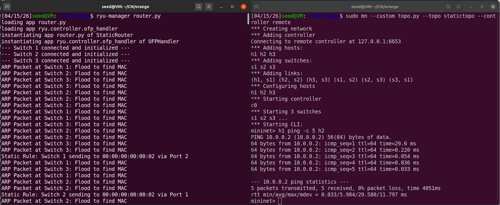
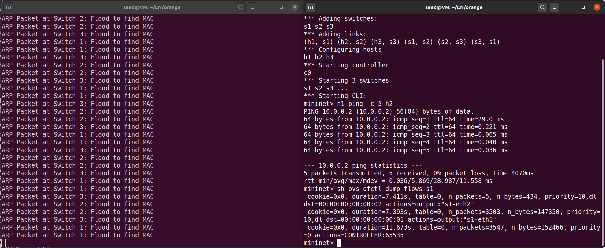
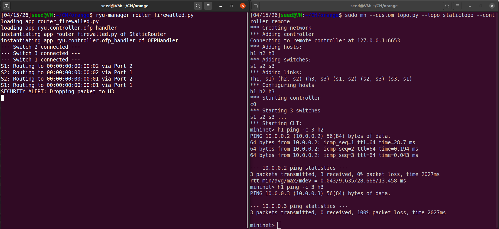
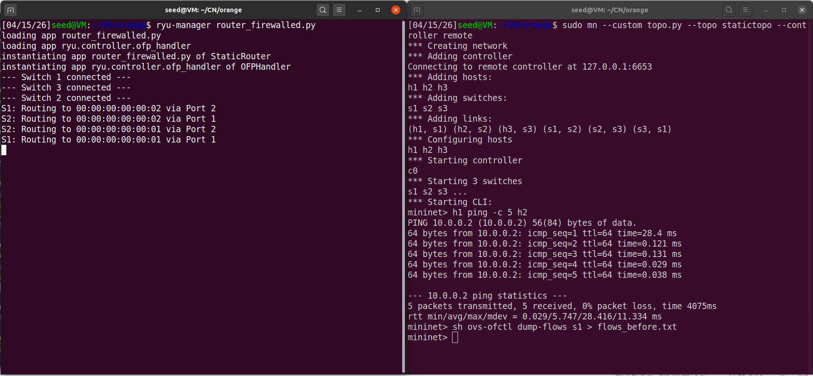
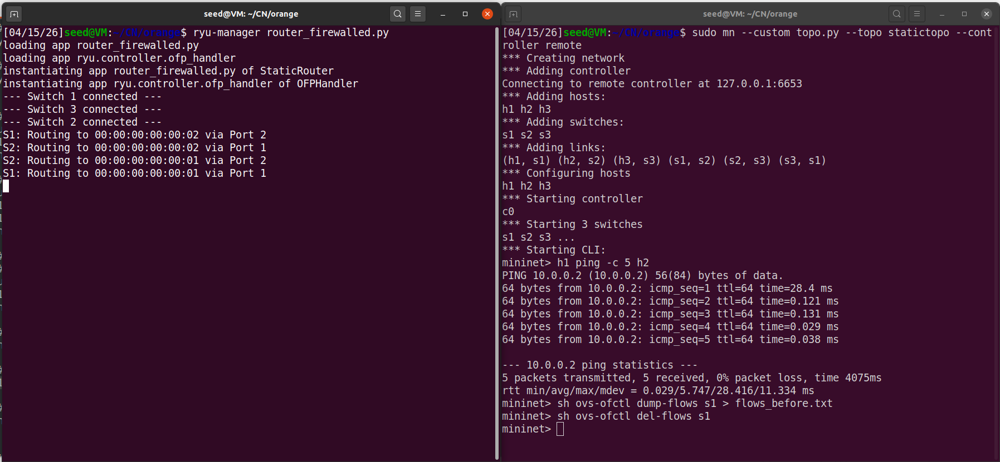
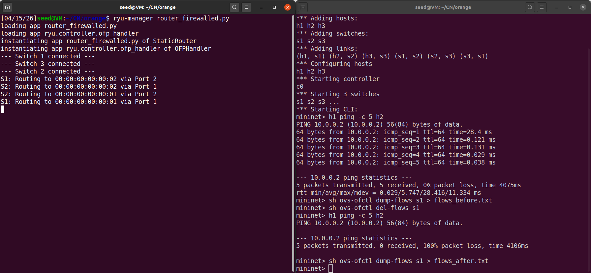
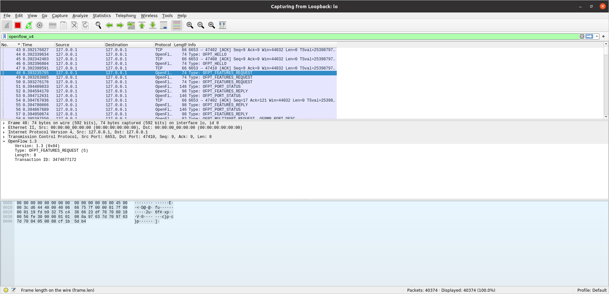
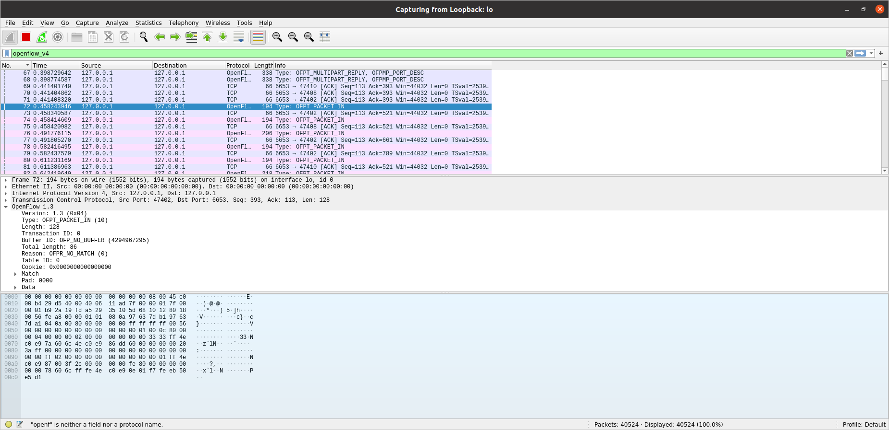
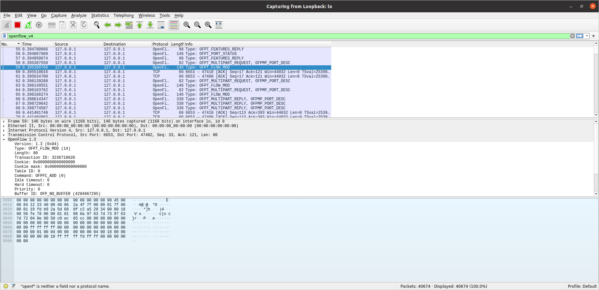
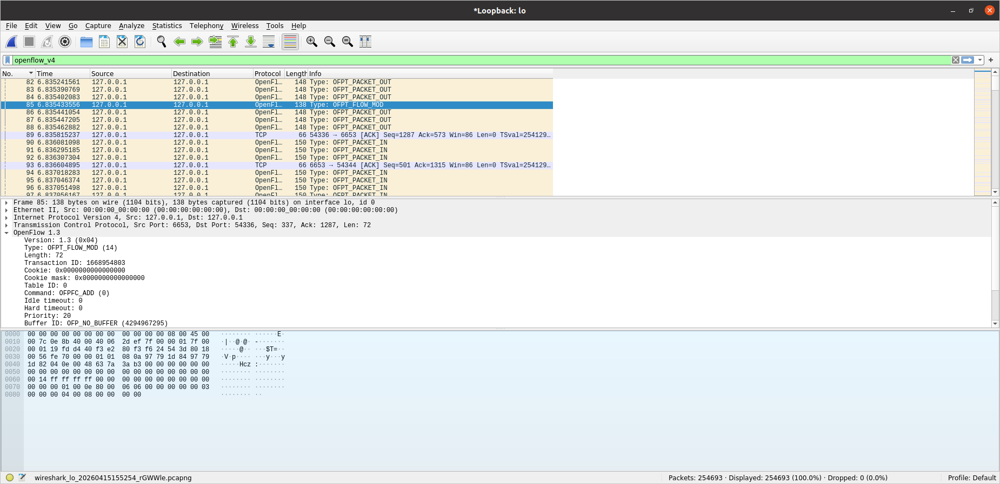

# Static Routing using SDN Controller

**Name:** Tanmay T A

**SRN:** PES1UG24CS492

**Class:** CSE, Sem 4, I Sec

## 1. Problem Statement

The objective of this project is to implement a Software Defined Networking (SDN) solution that demonstrates Static Routing using the OpenFlow 1.3 protocol. Instead of relying on traditional dynamic learning (like MAC learning), this project involves:

* Manually defining routing paths via a centralized Ryu controller.

* Implementing match-action flow rules to handle traffic.

* Enforcing security policies (Allowed vs. Blocked traffic).

* Validating network resilience through regression testing (ensuring paths remain unchanged after rule reinstallation).

## 2. Project Setup & Execution

### Prerequisites

* **OS:** Ubuntu VM

* **Tools:** Mininet, Ryu Controller, Wireshark, Python 3

### Step-by-Step Execution

**1. Clean Environment:**

```bash
sudo mn -c
```

**2. Launch Ryu Controller:**
Navigate to the project root and run:

```bash
ryu-manager src/router_firewalled.py
```

**3. Start Mininet Topology:**
In a second terminal, execute:

```bash
sudo mn --custom src/topo.py --topo statictopo --controller remote
```
## 3. Test Scenarios and Observations

### Scenario 1: Allowed Path (H1 to H2)

* **Action:** Run `h1 ping -c 4 h2` in Mininet.

* **Observation:** The ping is successful.

* **Explanation:** The controller receives the initial packet, identifies the destination MAC `00:00:00:00:00:02`, and installs a flow rule on Switch 1 to forward traffic out of Port 2.

* **Proof:**





### Scenario 2: Security Policy (Blocked H1 to H3)

* **Action:** Run `h1 ping -c 4 h3` in Mininet.

* **Observation:** 100% packet loss.

* **Explanation:** A specific rule in `router_firewalled.py` identifies traffic destined for H3 at Switch 1 and installs a "DROP" action (empty action list). This demonstrates a stateless SDN firewall.

* **Proof:**



### Scenario 3: Regression Testing

* **Action:**
    1. Capture current flows: `sudo ovs-ofctl dump-flows s1 > docs/flows_before.txt`

    2. Delete all flows: `sudo ovs-ofctl del-flows s1`

    3. Re-run pings and capture: `sudo ovs-ofctl dump-flows s1 > docs/flows_after.txt`

* **Observation:** Both files show identical flow entries for the same matches.

* **Explanation:** This proves the routing behavior is deterministic. Because the logic is hardcoded in the controller, the network re-establishes the exact same paths regardless of rule wipes.

* **Proof:**







## 4. Expected Output Documentation

### Flow Table Validation

The file `docs/flow_tables.txt` demonstrates the manually installed flow rules on Switch 1, showing the different priorities for routing (10) and blocking (20).

### Wireshark Protocol Analysis

Proof of the `OFPT_FEATURES_REPLY`, `OFPT_PACKET_IN`, and `OFPT_FLOW_MOD` messages sent from the Ryu controller to the Open vSwitch to push the static rules.









## 5. Repository Structure

* `/src/router.py`: Initial static routing logic.

* `/src/router_firewalled.py`: Final version with integrated security/blocking rules.

* `/src/topo.py`: Triangle topology definition.

* `diagram.txt`: Simplified diagramatic representation of the network.

* `/docs/flows_before.txt`: Flow table state before regression.

* `/docs/flows_after.txt`: Flow table state after reinstallation.
